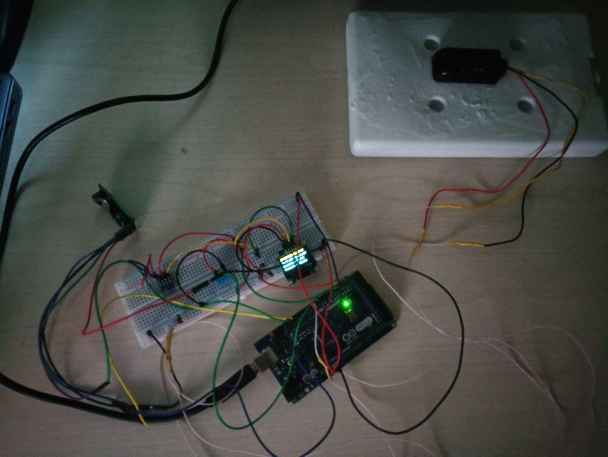

# Домашняя метеостанция
## Проект по IoT, выполнила Намаконова Вероника

### Содержание
* sources -> station_arduino  :  исходный код прошивки Arduino
* sources -> station_desktop  :  исходный код приложения на PC
    
* resources -> station_final_res  :  результат проектиорвания
* resources -> station_oled_res  :  вывод значений на дисплей
* resources -> station_desktop_res  :  пример работы программного обеспечения

### Итоговый результат 

### Вывод значений на дисплей

### Графическое приложение 

