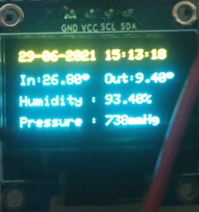
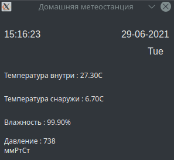

# Домашняя метеостанция
## Проект по IoT, выполнила Намаконова Вероника

### Содержание
* sources -> station_arduino  :  исходный код прошивки Arduino
* sources -> station_desktop  :  исходный код приложения на PC
    
* resources -> 

### Итоговый результат 

### Вывод значений на дисплей

### Графическое приложение 

